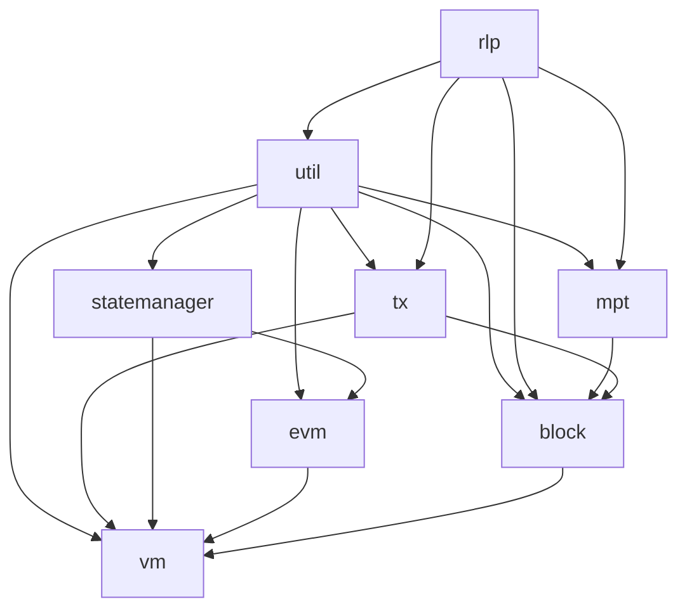

# QRL JS Monorepo

This repository contains the QRL-focused JavaScript execution stack adapted from the
upstream monorepo.

The active package surface is limited to the QRL local execution path and the small
generic helpers it still uses: RLP encoding, utility functions, local trie root
support, QRL transactions, blocks, state management, EVM-like execution, and the
local VM/provider layer.

Ethereum-specific packages that are not part of the QRL local execution path have
been removed from the workspace. Package names and internal imports use the QRL `@theqrl/*` scope.

## Active Packages

| Package | Purpose |
| ------- | ------- |
| [`@theqrl/block`](./packages/block) | QRL block, header, log, receipt, and root helpers. |
| [`@theqrl/evm`](./packages/evm) | QRL EVM-like bytecode interpreter and execution primitives. |
| [`@theqrl/mpt`](./packages/mpt) | Minimal deterministic trie-root helper used by QRL local execution. |
| [`@theqrl/rlp`](./packages/rlp) | RLP encoder/decoder retained as a generic serialization helper. |
| [`@theqrl/statemanager`](./packages/statemanager) | In-memory QRL account, storage, and genesis state manager. |
| [`@theqrl/tx`](./packages/tx) | QRL transaction construction, serialization, and signing helpers. |
| [`@theqrl/util`](./packages/util) | Generic byte helpers and QRL address utilities. |
| [`@theqrl/vm`](./packages/vm) | QRL local VM, provider formatting, block execution, and chain snapshots. |

## Getting Started

### Prerequisites

- Node.js v20 or newer
- npm v9 or newer
- Git

### Install

```sh
npm install
```

### Validate

Run all active workspace tests:

```sh
npm test --workspaces --if-present
```

Run the full local validation pass:

```sh
npm run build --workspaces --if-present
npm run tsc --workspaces --if-present
npm test --workspaces --if-present
npm run spellcheck
npm run lint:diff
```

## Package Relationships



## Upstream

The initial import source is recorded in [UPSTREAM_IMPORT.md](./UPSTREAM_IMPORT.md).
The QRL adaptation keeps only the local execution components needed by this fork.

## License

Most packages are [MPL-2.0](<https://tldrlegal.com/license/mozilla-public-license-2.0-(mpl-2)>)
licensed. See package folders for package-specific license files.
