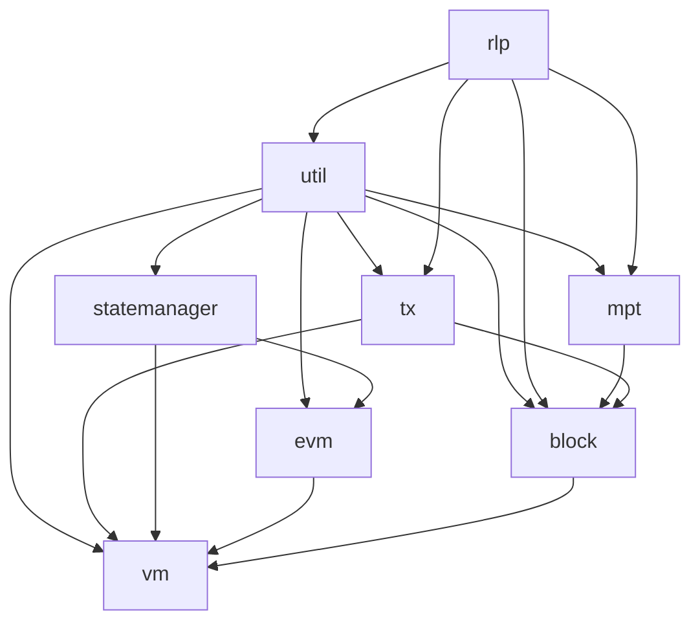

<p align="center">
  
</p>

# QRL JS Monorepo

## Table of Contents

- [Introduction](#introduction)
- [Active Packages](#active-packages)
- [Getting Started](#getting-started)
- [Packages Relationships](#packages-relationships)
- [License](#license)

## Introduction

[![Code Coverage][coverage-badge]][coverage-link]

This repository is being adapted from EthereumJS into a QRL-focused JavaScript monorepo. The active package surface is now limited to the QRL execution stack and the small generic helpers it still uses: RLP encoding, utility functions, local trie root support, QRL transactions, blocks, state management, EVM-like execution, and the local VM/provider layer.

Ethereum-specific packages that are not part of the QRL local execution path have been removed from the workspace.

## Active Packages

| package | npm | issues | tests | coverage |
| ------- | --- | ------ | ----- | -------- |
| [@ethereumjs/block][block-package] | [![NPM Package][block-npm-badge]][block-npm-link] | [![Block Issues][block-issues-badge]][block-issues-link] | [![Actions Status][block-actions-badge]][block-actions-link] | [![Code Coverage][block-coverage-badge]][block-coverage-link] |
| [@ethereumjs/evm][evm-package] | [![NPM Package][evm-npm-badge]][evm-npm-link] | [![EVM Issues][evm-issues-badge]][evm-issues-link] | [![Actions Status][evm-actions-badge]][evm-actions-link] | [![Code Coverage][evm-coverage-badge]][evm-coverage-link] |
| [@ethereumjs/mpt][mpt-package] | [![NPM Package][mpt-npm-badge]][mpt-npm-link] | [![MPT Issues][mpt-issues-badge]][mpt-issues-link] | [![Actions Status][mpt-actions-badge]][mpt-actions-link] | [![Code Coverage][mpt-coverage-badge]][mpt-coverage-link] |
| [@ethereumjs/rlp][rlp-package] | [![NPM Package][rlp-npm-badge]][rlp-npm-link] | [![RLP Issues][rlp-issues-badge]][rlp-issues-link] | [![Actions Status][rlp-actions-badge]][rlp-actions-link] | [![Code Coverage][rlp-coverage-badge]][rlp-coverage-link] |
| [@ethereumjs/statemanager][statemanager-package] | [![NPM Package][statemanager-npm-badge]][statemanager-npm-link] | [![StateManager Issues][statemanager-issues-badge]][statemanager-issues-link] | [![Actions Status][statemanager-actions-badge]][statemanager-actions-link] | [![Code Coverage][statemanager-coverage-badge]][statemanager-coverage-link] |
| [@ethereumjs/tx][tx-package] | [![NPM Package][tx-npm-badge]][tx-npm-link] | [![Tx Issues][tx-issues-badge]][tx-issues-link] | [![Actions Status][tx-actions-badge]][tx-actions-link] | [![Code Coverage][tx-coverage-badge]][tx-coverage-link] |
| [@ethereumjs/util][util-package] | [![NPM Package][util-npm-badge]][util-npm-link] | [![Util Issues][util-issues-badge]][util-issues-link] | [![Actions Status][util-actions-badge]][util-actions-link] | [![Code Coverage][util-coverage-badge]][util-coverage-link] |
| [@ethereumjs/vm][vm-package] | [![NPM Package][vm-npm-badge]][vm-npm-link] | [![VM Issues][vm-issues-badge]][vm-issues-link] | [![Actions Status][vm-actions-badge]][vm-actions-link] | [![Code Coverage][vm-coverage-badge]][vm-coverage-link] |

## Getting Started

### Prerequisites

- Node.js (v20 or higher)
- npm (v9 or higher)
- Git

### Initial Setup

```sh
npm install
```

### Development

Run all active workspace tests with:

```sh
npm test --workspaces --if-present
```

Run the full local validation pass with:

```sh
npm run build --workspaces --if-present
npm run tsc --workspaces --if-present
npm test --workspaces --if-present
npm run spellcheck
npm run lint:diff
```

## Packages Relationships



## License

Most packages are [MPL-2.0](<https://tldrlegal.com/license/mozilla-public-license-2.0-(mpl-2)>) licensed, see package folders for the respective license.

[coverage-badge]: https://codecov.io/gh/ethereumjs/ethereumjs-monorepo/branch/master/graph/badge.svg
[coverage-link]: https://codecov.io/gh/ethereumjs/ethereumjs-monorepo

[block-package]: ./packages/block
[block-npm-badge]: https://img.shields.io/npm/v/@ethereumjs/block.svg
[block-npm-link]: https://www.npmjs.com/package/@ethereumjs/block
[block-issues-badge]: https://img.shields.io/github/issues/ethereumjs/ethereumjs-monorepo/package:%20block?label=issues
[block-issues-link]: https://github.com/ethereumjs/ethereumjs-monorepo/issues?q=is%3Aopen+is%3Aissue+label%3A%22package%3A+block%22
[block-actions-badge]: https://github.com/ethereumjs/ethereumjs-monorepo/workflows/block/badge.svg
[block-actions-link]: https://github.com/ethereumjs/ethereumjs-monorepo/actions?query=workflow%3A%22block%22
[block-coverage-badge]: https://codecov.io/gh/ethereumjs/ethereumjs-monorepo/branch/master/graph/badge.svg?flag=block
[block-coverage-link]: https://codecov.io/gh/ethereumjs/ethereumjs-monorepo/tree/master/packages/block

[evm-package]: ./packages/evm
[evm-npm-badge]: https://img.shields.io/npm/v/@ethereumjs/evm.svg
[evm-npm-link]: https://www.npmjs.com/package/@ethereumjs/evm
[evm-issues-badge]: https://img.shields.io/github/issues/ethereumjs/ethereumjs-monorepo/package:%20evm?label=issues
[evm-issues-link]: https://github.com/ethereumjs/ethereumjs-monorepo/issues?q=is%3Aopen+is%3Aissue+label%3A%22package%3A+evm%22
[evm-actions-badge]: https://github.com/ethereumjs/ethereumjs-monorepo/workflows/evm/badge.svg
[evm-actions-link]: https://github.com/ethereumjs/ethereumjs-monorepo/actions?query=workflow%3A%22evm%22
[evm-coverage-badge]: https://codecov.io/gh/ethereumjs/ethereumjs-monorepo/branch/master/graph/badge.svg?flag=evm
[evm-coverage-link]: https://codecov.io/gh/ethereumjs/ethereumjs-monorepo/tree/master/packages/evm

[mpt-package]: ./packages/mpt
[mpt-npm-badge]: https://img.shields.io/npm/v/@ethereumjs/mpt.svg
[mpt-npm-link]: https://www.npmjs.com/package/@ethereumjs/mpt
[mpt-issues-badge]: https://img.shields.io/github/issues/ethereumjs/ethereumjs-monorepo/package:%20mpt?label=issues
[mpt-issues-link]: https://github.com/ethereumjs/ethereumjs-monorepo/issues?q=is%3Aopen+is%3Aissue+label%3A%22package%3A+mpt%22
[mpt-actions-badge]: https://github.com/ethereumjs/ethereumjs-monorepo/workflows/mpt/badge.svg
[mpt-actions-link]: https://github.com/ethereumjs/ethereumjs-monorepo/actions?query=workflow%3A%22mpt%22
[mpt-coverage-badge]: https://codecov.io/gh/ethereumjs/ethereumjs-monorepo/branch/master/graph/badge.svg?flag=mpt
[mpt-coverage-link]: https://codecov.io/gh/ethereumjs/ethereumjs-monorepo/tree/master/packages/mpt

[rlp-package]: ./packages/rlp
[rlp-npm-badge]: https://img.shields.io/npm/v/@ethereumjs/rlp.svg
[rlp-npm-link]: https://www.npmjs.com/package/@ethereumjs/rlp
[rlp-issues-badge]: https://img.shields.io/github/issues/ethereumjs/ethereumjs-monorepo/package:%20rlp?label=issues
[rlp-issues-link]: https://github.com/ethereumjs/ethereumjs-monorepo/issues?q=is%3Aopen+is%3Aissue+label%3A%22package%3A+rlp%22
[rlp-actions-badge]: https://github.com/ethereumjs/ethereumjs-monorepo/workflows/rlp/badge.svg
[rlp-actions-link]: https://github.com/ethereumjs/ethereumjs-monorepo/actions?query=workflow%3A%22rlp%22
[rlp-coverage-badge]: https://codecov.io/gh/ethereumjs/ethereumjs-monorepo/branch/master/graph/badge.svg?flag=rlp
[rlp-coverage-link]: https://codecov.io/gh/ethereumjs/ethereumjs-monorepo/tree/master/packages/rlp

[statemanager-package]: ./packages/statemanager
[statemanager-npm-badge]: https://img.shields.io/npm/v/@ethereumjs/statemanager.svg
[statemanager-npm-link]: https://www.npmjs.com/package/@ethereumjs/statemanager
[statemanager-issues-badge]: https://img.shields.io/github/issues/ethereumjs/ethereumjs-monorepo/package:%20statemanager?label=issues
[statemanager-issues-link]: https://github.com/ethereumjs/ethereumjs-monorepo/issues?q=is%3Aopen+is%3Aissue+label%3A%22package%3A+statemanager%22
[statemanager-actions-badge]: https://github.com/ethereumjs/ethereumjs-monorepo/workflows/statemanager/badge.svg
[statemanager-actions-link]: https://github.com/ethereumjs/ethereumjs-monorepo/actions?query=workflow%3A%22statemanager%22
[statemanager-coverage-badge]: https://codecov.io/gh/ethereumjs/ethereumjs-monorepo/branch/master/graph/badge.svg?flag=statemanager
[statemanager-coverage-link]: https://codecov.io/gh/ethereumjs/ethereumjs-monorepo/tree/master/packages/statemanager

[tx-package]: ./packages/tx
[tx-npm-badge]: https://img.shields.io/npm/v/@ethereumjs/tx.svg
[tx-npm-link]: https://www.npmjs.com/package/@ethereumjs/tx
[tx-issues-badge]: https://img.shields.io/github/issues/ethereumjs/ethereumjs-monorepo/package:%20tx?label=issues
[tx-issues-link]: https://github.com/ethereumjs/ethereumjs-monorepo/issues?q=is%3Aopen+is%3Aissue+label%3A%22package%3A+tx%22
[tx-actions-badge]: https://github.com/ethereumjs/ethereumjs-monorepo/workflows/tx/badge.svg
[tx-actions-link]: https://github.com/ethereumjs/ethereumjs-monorepo/actions?query=workflow%3A%22tx%22
[tx-coverage-badge]: https://codecov.io/gh/ethereumjs/ethereumjs-monorepo/branch/master/graph/badge.svg?flag=tx
[tx-coverage-link]: https://codecov.io/gh/ethereumjs/ethereumjs-monorepo/tree/master/packages/tx

[util-package]: ./packages/util
[util-npm-badge]: https://img.shields.io/npm/v/@ethereumjs/util.svg
[util-npm-link]: https://www.npmjs.com/package/@ethereumjs/util
[util-issues-badge]: https://img.shields.io/github/issues/ethereumjs/ethereumjs-monorepo/package:%20util?label=issues
[util-issues-link]: https://github.com/ethereumjs/ethereumjs-monorepo/issues?q=is%3Aopen+is%3Aissue+label%3A%22package%3A+util%22
[util-actions-badge]: https://github.com/ethereumjs/ethereumjs-monorepo/workflows/util/badge.svg
[util-actions-link]: https://github.com/ethereumjs/ethereumjs-monorepo/actions?query=workflow%3A%22util%22
[util-coverage-badge]: https://codecov.io/gh/ethereumjs/ethereumjs-monorepo/branch/master/graph/badge.svg?flag=util
[util-coverage-link]: https://codecov.io/gh/ethereumjs/ethereumjs-monorepo/tree/master/packages/util

[vm-package]: ./packages/vm
[vm-npm-badge]: https://img.shields.io/npm/v/@ethereumjs/vm.svg
[vm-npm-link]: https://www.npmjs.com/package/@ethereumjs/vm
[vm-issues-badge]: https://img.shields.io/github/issues/ethereumjs/ethereumjs-monorepo/package:%20vm?label=issues
[vm-issues-link]: https://github.com/ethereumjs/ethereumjs-monorepo/issues?q=is%3Aopen+is%3Aissue+label%3A%22package%3A+vm%22
[vm-actions-badge]: https://github.com/ethereumjs/ethereumjs-monorepo/workflows/vm/badge.svg
[vm-actions-link]: https://github.com/ethereumjs/ethereumjs-monorepo/actions?query=workflow%3A%22vm%22
[vm-coverage-badge]: https://codecov.io/gh/ethereumjs/ethereumjs-monorepo/branch/master/graph/badge.svg?flag=vm
[vm-coverage-link]: https://codecov.io/gh/ethereumjs/ethereumjs-monorepo/tree/master/packages/vm
